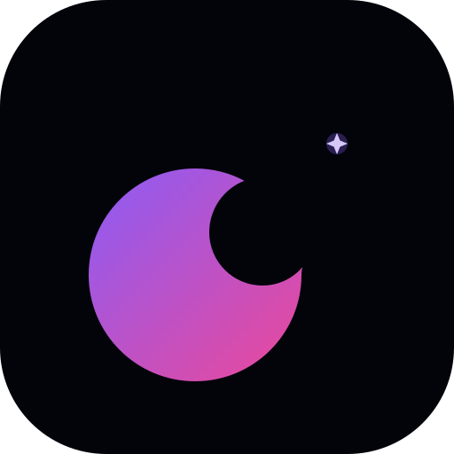

<h1 align="center">
  Late Night Thoughts 🌙
</h1>

<p align="center">
  
</p>

<p align="center">
  <strong>A beautiful, anonymous, and minimalistic journal for the thoughts that find you after midnight.</strong>
</p>

<p align="center">
  <a href="https://late-night-thoughts-five.vercel.app/"><strong>Explore the Live Application →</strong></a>
</p>

<p align="center">
  
  
  
  
  
</p>

---

## ✨ Features

- **Anonymous Identity**  
  Automatic anonymous authentication via Supabase—no accounts, no passwords. Just start writing.
  
- **Immersive Design**  
  A serene "Midnight Aurora" dark theme with ambient background effects, floating orbs, and subtle glassmorphism for a dreamlike experience.

- **Privacy First**  
  Choose to share thoughts publicly or keep them private. Enforced by **Row Level Security (RLS)** at the database level.

- **Personal Sanctuary**  
  The **“Mine”** tab lets you revisit all your past reflections across sessions using a persistent anonymous ID.

- **Mood Tagging**  
  Express your emotional state with curated mood tags (e.g., *melancholy*, *hopeful*, *restless*) and explore the public feed filtered by emotion.

- **Poetic Reading Mode**  
  Full-screen, distraction-free reading view optimized for deep focus and introspection.

- **Performance Optimized**  
  Built with Next.js **Incremental Static Regeneration (ISR)**—public thoughts load instantly and are SEO-friendly.

- **Production Ready**  
  Includes server-side rate limiting, content moderation filters, and abuse prevention for a safe, respectful community.

- **PWA Ready**  
  Installable on mobile devices with offline support, custom icon, and native-like journaling experience via `next-pwa`.

---

## 🚀 Tech Stack

| Layer               | Technology                     |
|---------------------|--------------------------------|
| **Framework**       | Next.js (App Router)           |
| **Language**        | TypeScript                     |
| **Styling**         | Tailwind CSS + Custom Themes   |
| **Authentication**  | Supabase Anonymous Auth        |
| **Database**        | PostgreSQL (via Supabase)      |
| **Security**        | Row Level Security (RLS)       |
| **State Management**| React Hooks + Supabase Realtime|
| **Offline Support** | `next-pwa` + Service Workers   |
| **Deployment**      | Vercel                         |
| **API Layer**       | Next.js Serverless API Routes   |

---

## 🛠️ Installation & Setup

1. **Clone the repository**:
   ```bash
   git clone https://github.com/your-username/late-night-thoughts.git
   cd late-night-thoughts
   ```

2. **Install dependencies**:
   ```bash
   npm install
   ```

3. **Configure Environment Variables**:
   Create a `.env` file in the root directory:
   ```env
   NEXT_PUBLIC_SUPABASE_URL=your_supabase_project_url
   NEXT_PUBLIC_SUPABASE_ANON_KEY=your_supabase_anon_key
   ```
   > 💡 Find these keys in your [Supabase Project Settings](https://app.supabase.com/project/_/settings/api).

4. **Set up Supabase**

   - ✅ **Enable Anonymous Authentication**  
     Go to your [Supabase Dashboard](https://app.supabase.com/) → **Authentication** → **Providers**, and enable **Anonymous Sign-ins**.

   - 🛠️ **Run the Setup SQL Script**  
     In your project’s **SQL Editor** (under **Database > SQL Editor**), execute the following script to create the `thoughts` table and enforce strict data privacy using **Row Level Security (RLS)**:

    ```sql
    -- Create the thoughts table
    create table thoughts (
      id uuid default gen_random_uuid() primary key,
      content text not null check (char_length(content) between 10 and 1000),
      mood text not null,
      is_public boolean default false,
      created_at timestamp with time zone default now(),
      user_id uuid not null references auth.users(id)
    );
    
    -- Enable Row Level Security (RLS)
    alter table thoughts enable row level security;
    
    -- Policy: Users can insert their own thoughts
    create policy "Users can insert own thoughts"
      on thoughts for insert
      with check (auth.uid() = user_id);
    
    -- Policy: Users can read their own private thoughts
    create policy "Users can read own thoughts"
      on thoughts for select
      using (auth.uid() = user_id);
    
    -- Policy: Public thoughts are visible to all users (including unauthenticated)
    create policy "Public thoughts are visible to all"
      on thoughts for select
      using (is_public = true);
    ```

5. **Run the development server**:
   ```bash
   npm run dev
   ```
   Visit `http://localhost:3000` to start journaling.

---

## 🔒 Security

This project implements industry-standard security practices:
- **Row Level Security (RLS)**: Direct database policies ensure users can only access their own private data.
- **JWT Verification**: API routes verify identity tokens server-side before processing any requests.
- **Rate Limiting**: Custom in-memory request throttling to prevent automated spam and abuse.
- **Anonymity by Design**: User identification is handled without storing personally identifiable information (PII).
> Your thoughts are yours alone, unless you choose otherwise.

---

## 🤖 Built With

This application was architected and developed using **OpenCode** and **Antigravity**, leveraging advanced agentic coding workflows to ensure clean architecture, minimalistic UI design, and robust functionality.

> "Great software balances logic, creativity, and human experience."

---

## 📜 License

Distributed under the **MIT License**. See [`LICENSE`](./LICENSE) for the full text.

---

<div align="center">

  🌌*Made for the quiet moments when the world falls silent.*

</div>

---
